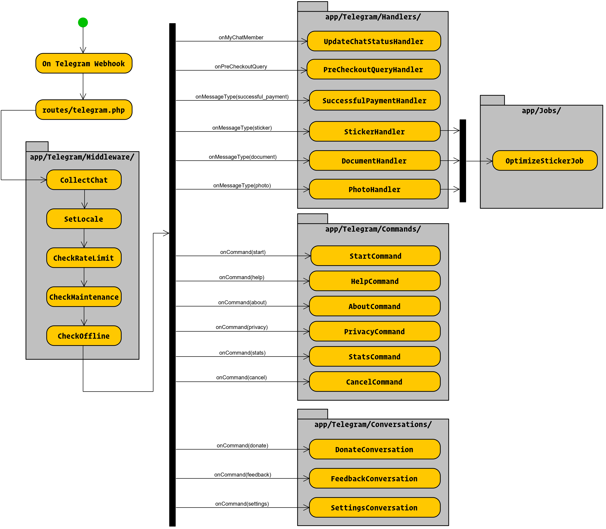

# Telegram Bot: Sticker Optimizer

> Optimize an image or sticker to a png file to make its size smaller than or equal to 512Kb,
> so that you will be able to add it to a sticker pack using the [@stickers](https://t.me/stickers) bot.

## 🛠 Built with

- Programming language: PHP 8.1
- Language framework: [Laravel](https://github.com/laravel/laravel)
- Bot framework: [Nutgram](https://github.com/SergiX44/Nutgram)

## 🛡 Requirements

- Apache / nginx
- SSL support
- PHP ≥ 8.1
    - ext-json
    - ext-pdo
    - ext-gd
    - webp support
- Imagick
- MariaDB ≥ 10.2.3 or Postgresql ≥ 9.5 or SQLite with JSON1 extension
- SystemD (to process async jobs)
- Crontab (to update cached statistics)
- GIT

## 🗃️ Flow chart

## 🚀 First deploy

0. `cd <vhost-folder>`
1. `git clone https://github.com/<username>/telegram-stickeroptimizer.git`
2. `cd telegram-stickeroptimizer`
3. `php artisan migrate`
4. `cp .env.example .env`
5. Edit the `.env` file with your preferences
6. `wget https://getcomposer.org/download/latest-2.x/composer.phar`
7. `php composer.phar install`
8. `sudo chmod -R 775 bootstrap/`
9. `sudo chmod -R 775 storage/`
10. `php artisan storage:link`
11. Create a new cron: `* * * * * cd /path-to-your-project && php artisan schedule:run >> /dev/null 2>&1`
12. Configure a SystemD Unit to execute: `php artisan queue:work --queue=news --memory=512`
13. `php artisan nutgram:register-commands`
14. `php artisan nutgram:hook:set https://<domain>.<tls>/hook`

## 🌠 Continuous deployment
This project will be updated in production at every pushed tag to master branch. 
Check this github workflow: [deploy.yml](.github/workflows/deploy.yml)

## ☑ TODO List
Check the [Projects](https://github.com/Lukasss93/telegram-stickeroptimizer/projects/2) page.

## 📃 Changelog
Please see the [changelog.md](changelog.md) for more information on what has changed recently.

## 🏅 Credits
- [Luca Patera](https://github.com/Lukasss93)
- [All Contributors](https://github.com/Lukasss93/telegram-stickeroptimizer/contributors)

## 📖 License
Please see the [LICENSE.md](LICENSE.md) file for more information.
